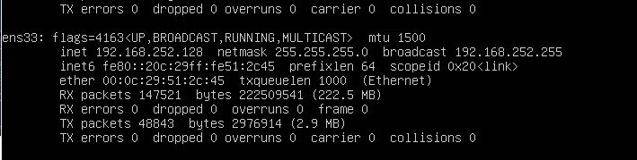
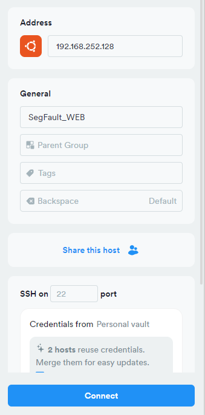
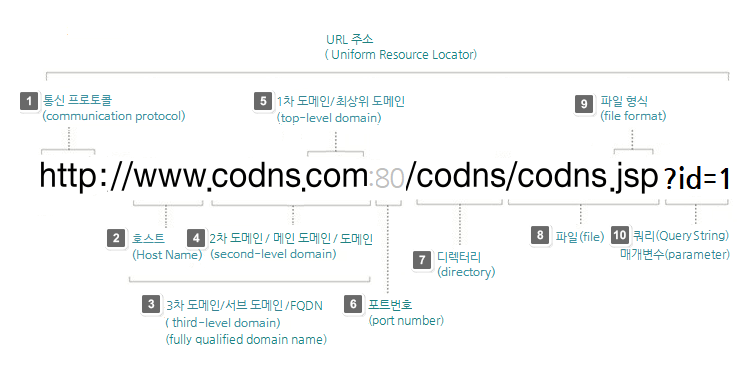
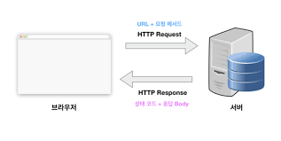

# [노말틱 모의 해킹 취업반 스터디  8기 1개월 1주차 OT&웹 서버 이해 (1)]

> **원본 포스트 ID**: 2
> **발행일**: 2025-04-04 12:24:11
> **카테고리**: 해킹공부/노말틱 취업반

## 📝 원문 내용

## **오티 수업 (라이브 코칭) 2025년 4월 2일 수업**

#### **1\. 모의 해킹 취업반 8기 수업 구성**

  1. **라이브 코칭 수요일 오후 9시는 이론수업은 없고 동기부여와 질문**
  2. **동영상강의는 수요일 라이브 코칭끝나면 영상은 2시간정도 일주일안에 듣기**
  3. **과제 빠듯하게 할만하게 내주지만 조급해하지말고 본인페이스에 맞게 할수있는 만큼만 해오기!!**

#### **2\. 해킹 공부 mind set!!**

  1. **조급해하지말기**
  2. **해킹공부는 컴퓨터공부니까 적극적이고 능동적이게 하자 오류가 뜨면 2시간이상은 찾아보고 고민해보는 능력 가지기!**
  3. **포기하지말기**

#### **3\. 스터디 활용법 200%**

  1. **끊어서 보지말기 끊어서 보면 집중력 ∇**
  2. **배속금지 말이 느리다고 속도를 배속하면 어느순간 못알아들음**
  3. **블로그 만들어서 공부한거 기록하기 나중에 취업할때 아주 큰도움이 될거임**
  4. **공부시간 하루 최소 3~4시간**

#### **4\. 모의해킹 취업 스펙**

  1. **4년제 학사**
  2. **자격증:정보보안기사,정보처리기사**

#### **5\. 커리큘럼**

  1. **1개월:웹서버 기초 (php,mysql)**
  2. **2~4개월:웹 해킹 (SQLi, XSS, CSRF, File, Auth)**
  3. **5개월:프로젝트(실제로 모의해킹 한것처럼 보고서작성 등등...)**
  4. **Final Test(끝나는주 토요일쯤 오프라인으로 진행 서울에서,실제 웹서버 취약점파악하고 모의 해킹? 그냥 재미로 하지만 합격하면 선물있음 노트북 지참)**

* * *

## 

## **1.실습환경 세팅하기**

#### 

#### **1.1 vmware 설치하기**

<https://www.broadcom.com/>

[ Broadcom Inc. | Connecting Everything Broadcom Inc. is a global technology leader that designs, develops and supplies a broad range of semiconductor, enterprise software and security solutions. www.broadcom.com ](https://www.broadcom.com/)

#### **1.2 Termius 설치**

**<https://termius.com/download/macos>**

[ Download Termius for macOS Download Termius for macOS. Download .DMG. Try Termius for mobile. Enjoy the secure sync and access your servers on the go with Termius mobile app. termius.com ](https://termius.com/download/macos)

#### 

#### **1.3 Termius 세팅**

**1\. ip 주소 확인**

VMware가상머신에서 SegFault_WEBdev inprot후 가상머신 구동

구동후 아이디 비밀번호 입력후 

ifconfig로 ip주소 확인

2\. Terminus hosts 세팅하기

* * *

## **2.웹 서버의 이해**

#### **2.1 웹 서버의 뜻**

웹 서버(web server)는 HTTP 또는 HTTPS를 통해 웹 브라우저에서 요청하는 HTML 문서나 오브젝트(이미지 파일 등)을 전송해주는 서비스 포로그램을 말한다 

"웹 서버"는 하드웨어,소프트웨어 혹은 두 개가 같이 동작하는 것을 의미할 수 있습니다.

1.하드웨어 측면에서,웹 서버는 웹 서버의 소프트웨어와 website의 컴포넌트 파일들을 저장하는 컴퓨터입니다.(컴포넌트 파일에는 HTML 문서,images,CSS stylesheets,그리고 javaScript files가 있습니다.)웹 서버는 인터넷에 연결되어 웹에 연결된 다른 기기들이 웹 서버의 데이터(컴포넌트 파일들)를 주고받을 수 있도록 합니다.

2.소프트웨어 측면에서 , 웹 서버는 기본적으로 웹 사용자가 어떻게 호스트 파일들에 접근하는지를 관리합니다.이 문서에서 웹 서버는 HTTP서버로 국한합니다.HTTP 서버는 URL(Web addresses)과 HTTP(당신의 브라우저가 웹 페이지를 보여주기 위해 사용하는 포로토콜)의 소프트웨어 일부입니다.

가장 기본적인 단계에서,브라우저가 웹 서버에서 불려진 파일을 필요로 할때,브라우저는 HTTP를 통해 파일을 요청합니다.요청이 올바른 웹서버(하드웨어)에 도달하였을 때, HTTP 서버(software)는 요청된 문서를 HTTP를 이용해 보내줍니다.

그래서 웹은 실제파일 전달하는 역할을 하므로 서버에있는 파일 자체를 그냥 화면에 보여주는 것이기때문에 웹 URL은 인터넷에서 특정 리소스의 위치를 나타내는 주소입니다. 

#### **2.2 URL에대한 설명**

#### **2.2(1) 통신프로토콜**

프로트콜 : 컴퓨터 또는 전자 기기 간의 원활한 통신을 위해 지키기로 약속한 규약.포로토콜에는 신호 처리법,오류 처리,암호,인증,주소 등을 포함한다.

종류는 다양하지만 HTTPS,HTTP에 관해서만 설명을 해보겠습니다

HTTP는 HTML 문서와 같은 리소스들을 가져올 수

있도록 해주는 프로토콜입니다.

여기서 HTTPS 는 HTTP의 보안이 강화된 버전입니다.

이런식으로

#### **2.2(2) 도메인 네임(Domain name)**

넓게 보면 외우거나 식별하기 어려운 IP 주소(예:192.168.20.1)를 example.com처럼 기억하기 쉽게 만들어주는 네트워크 호스트 이름을 의미하지만,보통 루투 네임 서버(최상위 DNS서버 이며 IANA에서 관리한다)등록된 최상위 호스트네임 및 각 최상위 호스트 네임을 관리하는 도메인 레지스트리에서 관리하는 하위 호스트 네임을 이르는 말이다.

그러므로 도메인 자리에 내 IP 주소를 입력하고 포트 디렉토리를 적으면 내가 컴퓨터에서 있는 자료를 공유할수있다.

#### **2.2(3) 포트**

여기서 포트란 일종의 "논리적인 접속 장소"입니다.

포트의 종류는 크게 3가지가있는데 잘 알려진 포트,동록된 포트,동적포트가있습니다

여기서 이제 웰노운 포트(well-known port)라는 포트중 80,443이 순서대로 HTTP,HTTPS 의 약속된 포트입니다.

그렇기 때문에 URL에 생략하더라도 작동합니다.

ex) <https://www.naver.com> = <https://www.naver.com:443>

[ 네이버 네이버 메인에서 다양한 정보와 유용한 컨텐츠를 만나 보세요 www.naver.com ](https://www.naver.com:443)

#### **2.2(4) 리소스 경로**

웹 서버에 있는 리소스의 경로입니다.웹 서버의 실제 파일 위치를 나타냅니다.

## 🔗 제텔카스텐 연결

### 관련 개념
- [[]]
- [[]]

### 프로젝트 연결
- [[]]

### 학습 포인트
-

## 📋 액션 아이템
- [ ]
- [ ]

## 💡 개인적 통찰

---

**태그**: #해킹공부노말틱취업반
**상태**: 🌱 씨앗 (제텔카스텐 통합 대기)
**변환일**: 2025-10-07
